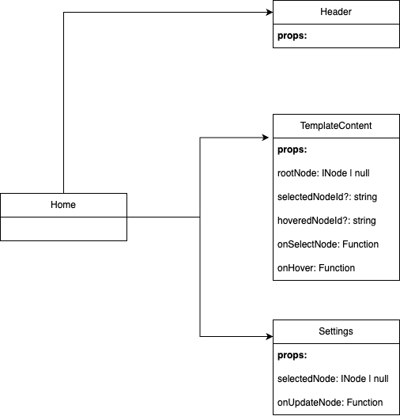

# Welcome to React Dynamic Render!

## Basic Idea

For first render, use React.createElement and traverse the node tree depth first to convert raw data to React DOM

For selecting node, capture node id and update to React state. From node id, we can find the node in the raw data using DFS and pass in the Settings (CSS selector) to display CSS props

For updating styling, whenever the CSS props is a valid JSON, Web will update the selected node's raw data to the new updates, then Web will update this updated node to the original raw data, then convert this updated data to React DOM using React.createElement

## Focus

@pages/Home/index.tsx
@pages/Home/Settings/index.tsx
@utils/contentRenderer.ts

## Folder Structure

```
├── package.json
├── package-lock.json
├── app
    ├── assets/        # Static assets
    ├── components/    # Common components
    ├── constants/     # constants
    ├── data/          # BE responses (real world: replaced by services)
    ├── pages/         # pages
    ├── typing/        # typescript types
    ├── utils/         # utility functions
```

## Component Tree



## Sequence Diagrams

### First Render


### Select


### Update


## Improvements

- Now when update, we need to re-render the whole tree, 1 improvement would be just re-render the updated node and its children
- Css Selector is still in basic UI, improvements are to make it easier to use

## Setup

npm i && npm run dev

access [local](http://localhost:5173/)

## Test cases

- First Render (template.ts is data)
- Select component
- Hover component
- Update styling (add style, modify style, delete style)

## Expectation

- It's not a production ready project and done in a short time to present basic solution and simple implementation, so may find some bugs along the way
